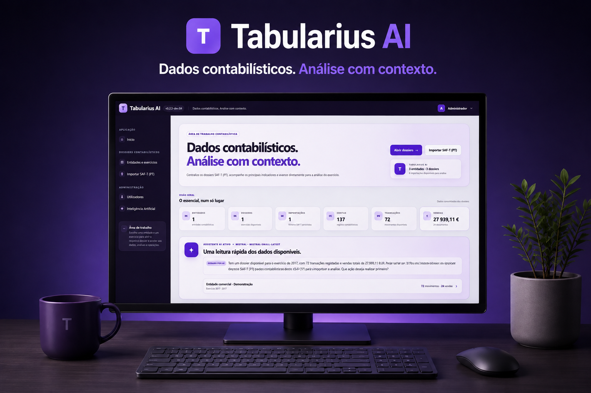

<div align="center">

# Tabularius AI

### Dados contabilísticos. Análise com contexto.



[](https://dotnet.microsoft.com/)
[](https://learn.microsoft.com/aspnet/core/)
[](https://www.sqlite.org/)
[](https://www.microsoft.com/sql-server/)
[](https://www.docker.com/)
[](LICENSE)

</div>

Tabularius AI é uma aplicação para importar, explorar e analisar dados contabilísticos a partir de ficheiros **SAF-T (PT)**. Organiza o trabalho por **Entidade → Dossier / exercício → Importação SAF-T**, preservando sempre a origem dos dados utilizados em cada análise.

Os cálculos contabilísticos são determinísticos. A Inteligência Artificial é opcional e acrescenta interpretação e contexto aos resultados, sem substituir os valores calculados pela aplicação.

## Principais funcionalidades

- Gestão de entidades, dossiers e exercícios contabilísticos.
- Importação e persistência estruturada de ficheiros SAF-T (PT).
- Suporte para múltiplas importações por dossier, mantendo explícita a fonte selecionada.
- Consulta de contas, clientes, fornecedores, produtos e tabela de impostos.
- Exploração de lançamentos contabilísticos e respetivas linhas de débito e crédito.
- Consulta de documentos de vendas, documentos de conferência, movimentação de mercadorias e recibos.
- **Balancete**, **Demonstração de Resultados** e **Balanço** calculados deterministicamente.
- Área analítica com visão geral, deteção de anomalias, análise de contas e análise de IVA.
- Investigação detalhada de contas e movimentos.
- Assistente AI e relatórios analíticos AI opcionais, com suporte para fornecedores configuráveis.
- Backup e restauro de dossiers.
- Autenticação, perfis e administração de utilizadores.
- Modo local com SQLite e modo servidor multiutilizador com SQL Server e Docker.

> O suporte atual não constitui validação formal do ficheiro contra o XSD oficial do SAF-T (PT).

## Utilização

O Tabularius AI pode ser executado de duas formas: localmente para utilização individual ou num servidor para acesso partilhado por vários utilizadores.

### Modo local — single user

O modo local é a opção mais simples para utilização individual. A aplicação corre diretamente no computador e utiliza **SQLite**, sem necessidade de instalar ou administrar SQL Server.

Requisitos para desenvolvimento: **.NET 9 SDK**.

```powershell
git clone https://github.com/ruialexrib/tabularius-ai.git
cd tabularius-ai
dotnet restore
dotnet run --project src/TabulariusAI.Web
```

A aplicação fica disponível apenas localmente e utiliza a base de dados SQLite em `data/tabularius.db`.

Em Windows também pode ser criada uma publicação self-contained:

```bat
publish-local.bat
```

O resultado é colocado em:

```text
artifacts\publish\win-x64\
```

Execute `TabulariusAI.Web.exe`. A aplicação inicia o servidor local e abre o browser automaticamente.

### Modo servidor — multiuser com Docker

Para utilização partilhada, o Tabularius AI pode ser executado com **Docker Compose**. Neste modo são utilizados dois containers principais:

```text
Browser
   │
   │ :8080
   ▼
Tabularius AI
ASP.NET Core
   │
   ▼
SQL Server 2022 Express
```

Clone o repositório e crie o ficheiro de configuração:

```powershell
git clone https://github.com/ruialexrib/tabularius-ai.git
cd tabularius-ai
Copy-Item .env.example .env
```

Defina uma password segura para o SQL Server em `.env`:

```text
TABULARIUS_DB_PASSWORD=replace-with-a-strong-private-password
```

Inicie a aplicação:

```powershell
docker compose up -d --build
docker compose ps
```

Aceda a:

```text
http://localhost:8080
```

Em Windows pode utilizar diretamente:

```bat
start-docker.bat
```

Os dados do SQL Server e os logs são mantidos em volumes Docker persistentes.

### Dados de acesso por defeito

Na primeira execução é criada automaticamente uma conta de administração:

| Campo | Valor |
| --- | --- |
| Utilizador | `admin` |
| Email | `admin@tabularius.local` |
| Password temporária | `LetMeIn` |
| Perfil | Administrador |

A password inicial é temporária. A aplicação exige a sua alteração antes de permitir a utilização normal da conta.

## Inteligência Artificial

A utilização de AI é opcional. Quando configurada, pode ser utilizada para conversar com os dados do dossier e gerar interpretações dos indicadores apresentados nas áreas analíticas.

A arquitetura mantém uma separação explícita entre:

```text
Dados SAF-T → regras e cálculos determinísticos → resultados contabilísticos
                                                ↓
                                      interpretação opcional por AI
```

O modelo não é a fonte dos totais contabilísticos. Os valores calculados deterministicamente pelo Tabularius AI prevalecem sobre qualquer formulação produzida pelo modelo.

## Contribuir

As contribuições devem ser efetuadas através de **pull requests** e manter-se focadas numa alteração claramente identificável.

Antes de submeter uma contribuição:

- crie uma branch a partir da versão mais recente de `main`;
- mantenha a alteração pequena e focada;
- preserve a rastreabilidade da importação SAF-T utilizada;
- não agregue silenciosamente dados provenientes de importações diferentes;
- mantenha os cálculos contabilísticos determinísticos separados da AI generativa;
- inclua testes quando a alteração introduzir comportamento testável;
- garanta que o projeto compila e que os testes existentes continuam a passar;
- utilize PT-PT na interface e inglês no código, documentação técnica e mensagens de commit;
- nunca inclua passwords, API keys, tokens, ficheiros `.env` ou dados contabilísticos reais no repositório.

Alterações significativas de arquitetura, base de dados, parsing SAF-T, segurança, deployment ou integrações AI devem ser discutidas antes da implementação.

Consulte [CONTRIBUTING.md](CONTRIBUTING.md) para as regras completas de contribuição.

## Licença

Distribuído sob a [MIT License](LICENSE).

Copyright © 2026 [Rui Ribeiro](https://github.com/ruialexrib).
